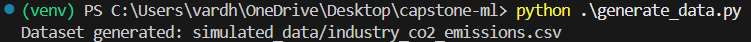
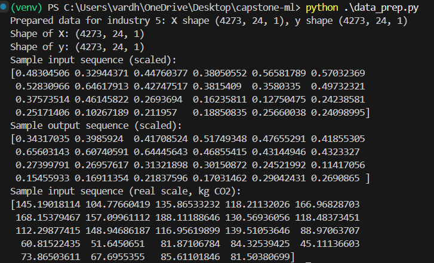
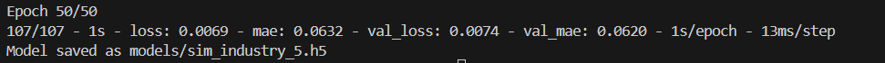
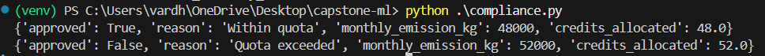
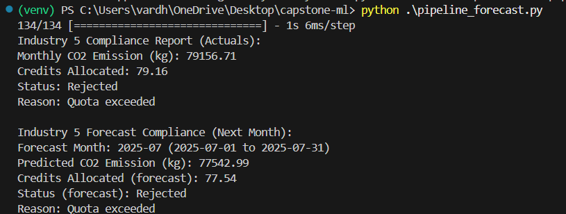

# Carbon Emission Monitoring & Forecasting —  Report


### A) `simulate_data.py` — Dataset Generator

**Purpose:**  
Generates a realistic, noisy time series of hourly CO₂ emissions for multiple industries and saves it to a CSV file used by the rest of the pipeline.


**Key Components:**

- **`simulate_co2_emissions(...)`**  
  Creates an hourly CO₂ emission series with:
  - **Trend** — gradual long-term increase/decrease
  - **Daily seasonality** — patterns repeating every day
  - **Weekly seasonality** — patterns repeating weekly
  - **Random noise** — small fluctuations
  - **Occasional spikes** — to simulate unusual events

- **`generate_dataset()`**  
  - Loops through multiple industries (`1..5`)
  - Generates data for ~**180 days × 24 hours**
  - Saves results to:
    ```
    simulated_data/industry_co2_emissions.csv
    ```


**CSV Structure:**

| Column           | Type     | Description                                      |
|------------------|----------|--------------------------------------------------|
| `timestamp`      | datetime | Hourly timestamp (`YYYY-MM-DD HH:MM:SS`)          |
| `industry_id`    | int      | Industry identifier                              |
| `co2_kg`         | float    | CO₂ emissions per hour (kg)                      |
| `interval_hours` | int      | Interval size (currently `1`)                    |


---
---
### B) `data_prep.py` — Data Preprocessing

**Purpose:**  
Loads the simulated CO₂ dataset, filters it for a given industry, scales the values, and prepares the data for LSTM model training.


**Key Components:**

- **`load_and_preprocess(industry_id, look_back=24)`**  
  Steps:
  1. **Load CSV**  
     Reads:
     ```
     simulated_data/industry_co2_emissions.csv
     ```
  2. **Filter by industry**  
     Keeps only rows where `industry_id` matches the input parameter.
  3. **Sort & reset index**  
     Ensures chronological order for time series modeling.
  4. **Extract target column**  
     Uses `co2_kg` as the prediction variable.
  5. **Scale data**  
     Uses `MinMaxScaler` to normalize CO₂ values between 0 and 1.
  6. **Create sliding windows**  
     Prepares `X` (features) and `y` (labels) based on `look_back` hours.


**Inputs:**
- `industry_id` — Integer (1 to 5 in current dataset)
- `look_back` — Number of past hours to use for predicting the next value (default: 24)

**Outputs:**
- `X` — Feature matrix for LSTM
- `y` — Target values
- `scaler` — Fitted MinMaxScaler (used later for inverse transform)



---
---

### **C) `train_model.py` — Model Training**


**Purpose:**  
Trains an LSTM model for a specific industry’s CO₂ emissions using the preprocessed data and saves the trained model.


**Key Components:**

- **`train_lstm(industry_id)`**  
  Steps:
  1. Load preprocessed data (`X`, `y`, `scaler`) from `data_prep.py`.
  2. Define LSTM architecture:
     - Input layer matching `look_back` sequence length
     - LSTM hidden layers
     - Dense output layer for regression
  3. Compile model (e.g., Adam optimizer, MSE loss).
  4. Train the model on the dataset.
  5. Save the trained model to:
     ```
     models/sim_industry_{industry_id}.h5
     ```

**Inputs:**
- `industry_id` — Integer (1 to 5 in current dataset)

**Outputs:**
- Saved LSTM model (`.h5` format)



---
---

### D) `compliance.py` — Compliance Logic

**Purpose:**  
Evaluates whether an industry’s monthly CO₂ emissions are within approved limits.


**Key Components:**

- **`compliance_report(total_month_kg)`**  
  - Compares `total_month_kg` against a predefined compliance threshold.
  - Returns:
    - `"Approved"` if emissions are within limit.
    - `"Flagged"` if emissions exceed limit.


**Inputs:**
- `total_month_kg` — Float, total CO₂ emissions for a month in kg.

**Outputs:**
- String: `"Approved"` or `"Flagged"`



---
---
### E) `pipeline.py` — Forecasting & Compliance Check

**Purpose:**  
Runs the full pipeline: loads the latest actuals, forecasts future CO₂ emissions, checks compliance, and prints a report.


**Key Components:**

- **Actual Data Load:**  
  Gets the last 30 days of actual CO₂ emissions for the industry.

- **Forecasting (Recursive LSTM):**  
  Uses the trained LSTM to predict the next month’s emissions hour-by-hour.

- **Compliance Check:**  
  Passes total forecasted monthly emissions to `compliance_report()`.

- **Reporting:**  
  Displays in console:
  - Industry ID
  - Last 30 days actuals compliance status
  - Next month forecast compliance status
    


---
---


